# Parallel Key Geometric Flow (PKGF), Destructive PKGF, and Unified PKGF
**A Geometric Theoretical Framework Describing the Construction, Deconstruction, and Metabolism of Intelligence**

**Author:** Fumio Miyata  
**Date:** April 8, 2026  
**DOI:** [10.5281/zenodo.19481201](https://doi.org/10.5281/zenodo.19481201)  
**Repository:** [github.com/aikenkyu001/PKGF_theory](https://github.com/aikenkyu001/PKGF_theory)  

---

# Abstract

This study proposes **Parallel Key Geometric Flow (PKGF)** as a novel geometric theoretical framework for the unified description of the construction, deconstruction, and reconstruction of intelligence. PKGF is built upon an internal automorphism map $K$ on a manifold, an exterior connection $\nabla$, a gauge group $\mathcal{G}$, and a semantic potential $\Omega$, axiomatically formulating the logical structure, memory, transformation, and interaction of intelligence. First, we define **Constructive PKGF** (Construction Theory), which governs order formation, and demonstrate its properties—such as the preservation of sector decomposition, retention of gauge invariants, and alignment of logical structures—as theorems. Next, we introduce **Destructive PKGF** (Deconstruction Theory), which describes structural coarse-graining, degeneracy, and singularity generation, elucidating the irreversibility of rank reduction, entropy increase, and dimensional collapse driven by the dissipative operator $\mathcal{D}(K)$. Furthermore, we present **Unified PKGF** (Metabolic Theory of Intelligence), integrating construction and deconstruction into a single dynamic system. This unified approach provides a comprehensive explanation for phenomena such as spontaneous gauge symmetry breaking, the existence of metabolic fixed points, quasi-periodic oscillations of logical volume, and hierarchical phase transitions with dimensional leaps. These results establish a new framework that views intelligence as a metabolic cycle of "Construction $\leftrightarrow$ Deconstruction $\leftrightarrow$ Reconstruction," providing a geometric foundation for understanding intellectual phenomena including the stabilization of logical structures, the transformation of conceptual systems, and the emergence of creativity. Positioned at the intersection of formal models of intelligence, complex systems, cognitive science, information geometry, and gauge theory, this theory functions as a new mathematical structure for describing the universal dynamics of intelligence.

---

# 0. Introduction

Parallel Key Geometric Flow (PKGF) is a theory that geometrically describes the **logical structure, memory, transformation, and interaction of intelligence** through a structural map $K$ on a manifold.

The framework consists of three constituent theories:

1. **Constructive PKGF (Construction Theory)**  
   Creates order, strengthens structures, and enhances logical consistency.

2. **Destructive PKGF (Deconstruction Theory)**  
   Breaks down order, coarse-grains structures, degenerates degrees of freedom, and generates singularities.

3. **Unified PKGF (Metabolic Theory)**  
   Integrates construction and deconstruction into a single dynamic process, describing intelligence as a metabolic cycle of "Construction $\leftrightarrow$ Deconstruction $\leftrightarrow$ Reconstruction."

---

# 1. Constructive PKGF (Construction Theory)

## 1.1 Axioms (P1–P7)

**P1: Tangent Bundle Decomposition**  
\[
TM = \bigoplus_{\alpha \in I} E_\alpha.
\]
- **Context**: Guarantees the "modularity" of intelligence. It provides the geometric foundation for different conceptual domains (sectors) to exist independently yet coexist.

**P2: Internal Automorphism Field**  
\[
K \in \Gamma(\mathrm{End}(TM)).
\]
- **Context**: Fixes the "transformation rules" between concepts. $K$ acts as a "key" that logically maps one state of information to another, determining the orientation of thought.

**P3: Gauge Group**  
\[
\mathcal{G} \subset \Gamma(\mathrm{GL}(TM))
\]
preserves $K$ and the sectors.
- **Context**: Invariance under "changes in perspective." It requires that the core logical structure remains intact even if the premises of inference or linguistic expressions change.

**P4: Exterior Connection**  
A connection $\nabla$ and curvature $F = d\omega + \omega \wedge \omega$.
- **Context**: Describes "remote correlations" of knowledge. It expresses how learning at one point spreads through the connection to influence the logic of other domains. The definitions of gauge connection and curvature follow the standard geometric configurations by Donaldson [3] and Haydys [4].

**P5: Coupling Equation (Constructive PKGF)**  
\[
\nabla K = [\Omega, K].
\]
- **Context**: **The essence of construction.** It represents the process where external information (connection $\nabla$) and internal logic ($K$) align "in parallel" through the interaction term $\Omega$.

**P6: Full Gauge Covariance**  
Formally invariant under adjoint transformations.
- **Context**: Guarantees that the dynamics of intelligence remain equivalent regardless of the coordinate system (language or viewpoint) used. The gauge covariance of PKGF has a structure independent of the choice of local frames, similar to the formulation of Gauge Equivariant CNNs by Cohen & Weiler [2].

**P7: Information Coupling**  
\[
\Omega = \Omega(\psi(\Phi), x).
\]
- **Context**: The interface where abstract "semantics ($\Phi$)" are converted into concrete geometric potentials.

---

## 1.2 Definitions

- **PKGF Structure**  
    A PKGF structure is a quintuple $(M, K, \nabla, \Omega, \mathcal{G})$ representing a set of geometric data on a manifold $M$ that satisfies axioms P1–P7. It is a formal representation integrating the "hardware" (manifold) and "software" (parallel key and connection) of intelligence with its "invariance" (gauge group).
- **Parallel Key $K$**  
    - **Role as a (1,1)-tensor**: An operator that deforms and transforms vectors (directions of thought) in the tangent space.
    - **Conserved Quantity of Logical Structure**: In the flow of Constructive PKGF, $\det(K)$ and its spectrum are preserved as the "volume" or "core" of logic.
    - **Relationship with Gauge Transformations**: Through the adjoint transformation $K \mapsto H K H^{-1}$, the style of representation can be changed while preserving the logical content.
- **Manifold Structure and Sector Decomposition**  
    The state space of intelligence is defined as a finite-dimensional smooth Riemannian manifold $M^d$. Axiom P1 mandates sector decomposition as a universal structure of intelligence.
    **Standard Implementation:**
    For theoretical verification, we adopt a representative model with $d=32$, divided into **four orthogonal sectors (8 dimensions $\times$ 4)**:
    \[ TM = E_S \oplus E_E \oplus E_A \oplus E_C \]
    - **Subject Sector ($E_S$)**: Internal dynamics such as inner tension, desires, and self-reference.
    - **Entity Sector ($E_E$)**: Internal vibrational rhythms, periodicity, and existential states.
    - **Action Sector ($E_A$)**: Orientation of behavior, movement, and decision-making.
    - **Context Sector ($E_C$)**: External environment, social constraints, and context.
    This decomposition is preserved under time evolution, geometrically fixing the "modularity" of intelligence.

- **Contextual Warping Metric**  
    The metric tensor $g$ on the manifold $M$ is dynamically modulated by the mean value of the Context sector $\bar{x}_{\text{ctx}}$:
    \[ g_{ii}(x) = \begin{cases} 1.0 + 0.5 \tanh(\bar{x}_{\text{ctx}}) & (i \in S, E, A) \\ 1.0 & (i \in C) \end{cases} \]
    **Significance:**
    - **Strong Context (dominant external situation)**: The "distance" between the Subject, Entity, and Action sectors increases, making them harder to change—representing **conservatism**.
    - **Weak Context (high degree of freedom)**: The distance decreases, making them easier to change—representing **flexibility**.
    This geometrically expresses the universal property of intelligence: "learning flexibly in stable situations and becoming conservative in harsh ones."

- **Sixteen Fields of Intelligence**  
    In PKGF, intelligence is defined as 16 interacting fields, implemented as an additive decomposition of the coupling potential $\Omega$:
    \[ \Omega = \sum_{i=1}^{16} \Omega^{(i)}(\psi(\Phi), x) \]
    Each potential term $\Omega^{(i)}$ is geometrically embedded as a metric $g$, a connection $\nabla$, or a potential term, determining the dynamics of intelligence.
    1. **Semantics**: The field holding the content and semantic structure of concepts.
    2. **Context**: The field holding situational constraints and environmental information.
    3. **Metric**: The field determining importance, weighting, and distance structure.
    4. **Transformation**: The field representing mappings, inference, and transformation rules between concepts.
    5. **Desire**: The field generating goal-orientation and motivation.
    6. **Ethics**: The field defining the permissible range of behavior and value judgments.
    7. **Emotion**: The field representing the accumulation of internal vibrations, fluctuations, and tension.
    8. **Value**: The field deciding rewards, evaluations, and priorities.
    9. **Learning**: The field governing the accumulation and updating of experience.
    10. **Memory**: The field holding past states and structures.
    11. **Metacognition**: The field monitoring and evaluating one's own state.
    12. **Meta-Update**: The field updating the learning rules themselves.
    13. **Self-Reference**: The field holding the self-model and self-identity.
    14. **Awareness**: The field governing attention, focus, and manifestation.
    15. **Strategy**: The field governing long-term planning and decision-making.
    16. **Social**: The field representing interactions, cooperation, and competition with others.
    These 16 fields couple as potential terms in the velocity determination equation of PKGF to dictate the dynamics of intelligence.

---

## 1.3 Theorems (Construction Phase)

### Theorem 1 (Preservation of Gauge Invariants)
**Statement.**  
Under the adjoint action $K \mapsto H K H^{-1}$ of the gauge group $\mathcal{G}$, the following quantities are invariant:
\[ \det(K), \quad \mathrm{Spec}(K). \]
**Interpretation.**  
The "volume" and "eigenmodes" of the logical structure remain unchanged regardless of the viewpoint (gauge). This is the fundamental principle of PKGF: "the essence of thought is independent of its representation."

### Theorem 2 (Theorem of Logical Invariance)
**Statement.**  
For the adjoint holonomy update $K(t+dt) = e^{\Omega dt} K(t) e^{-\Omega dt}$:
\[ \frac{d}{dt} \det(K) = 0. \]
**Interpretation.**  
The "weight" of logic is preserved even as learning or transformations occur. This guarantees that Constructive PKGF performs "consistent transformations rather than destruction."

### Theorem 3 (Preservation of Decomposition)
**Statement.**  
If $[K, \Pi_\alpha] = 0$ holds at the initial time, then under the flow of Constructive PKGF:
\[ K(E_\alpha) \subset E_\alpha \]
is preserved for all time.
**Interpretation.**  
Sectors (conceptual domains) do not mix, and their independence is maintained. This guarantees the "modularity" of PKGF.

### Theorem 4 (Gauge Transformation Law of Curvature)
**Statement.**  
For the gauge transformation of the connection $\omega \mapsto H \omega H^{-1} + H dH^{-1}$, the curvature transforms as:
\[ F \mapsto H F H^{-1} \]
**Interpretation.**  
The structure of external information (connection) is essentially the same regardless of the viewpoint. This is the basis for PKGF to "correctly handle the structure of the external world."

### Theorem 5 (Spontaneous Symmetry Breaking via Internal Tension)
**Statement.**  
When the time integral of internal tension $A(t)$ exceeds a critical value $A_c$, the PKGF flow bifurcates from a continuous symmetry to a discrete set of attractors:
\[ \mathcal{L} = \{ L_{\text{high}}, L_{\text{mid}}, L_{\text{low}} \}. \]
**Interpretation.**  
Intelligence "hierarchicalizes as tension increases." This explains the natural emergence of social structures and conceptual hierarchies.

### Theorem 6 (Theorem of Dimensional Resolution)
**Statement.**  
In multi-agent PKGF, if the relationship between the spatial dimension $D$ and the number of agents $n$ is $D < n$, the system remains in a high-energy state with perpetual conflict and competition. Conversely, if $D \ge n$, the system converges to a low-energy two-tier attractor.
**Interpretation.**  
"Conflict occurs when space is too narrow for the complexity." This is why PKGF can explain social dynamics.

### Theorem 7 (Resonance Theorem of Parallel Keys)
**Statement.**  
Under a stable social hierarchical structure:
\[ [K_i, F] \to 0 \quad (t \to \infty). \]
**Interpretation.**  
Individual logic ($K$) and social goals ($F$) align, and friction disappears. This represents the "stabilization of order."

---

## 1.4 Proofs

### Proof of Theorem 1 (Gauge Invariants)
From the basic properties of the adjoint action:
\[ \det(H K H^{-1}) = \det(K) \]
holds. Since eigenvalues are invariant under adjoint transformations:
\[ \mathrm{Spec}(H K H^{-1}) = \mathrm{Spec}(K). \]

### Proof of Theorem 2 (Logical Invariance)
Differentiating the update equation $K(t+dt) = e^{\Omega dt} K(t) e^{-\Omega dt}$ yields:
\[ \dot{K} = [\Omega, K]. \]
Substituting this into the derivative formula for the determinant $\frac{d}{dt} \det(K) = \det(K) \mathrm{Tr}(K^{-1} \dot{K})$ gives:
\[ \mathrm{Tr}(K^{-1} [\Omega, K]) = \mathrm{Tr}(K^{-1} \Omega K - K^{-1} K \Omega) = \mathrm{Tr}(\Omega - \Omega) = 0 \]
(by the properties of trace and commutators). Thus the conclusion follows.

### Proof of Theorem 3 (Preservation of Decomposition)
When $[K, \Pi_\alpha] = 0$ holds, the right-hand side of $\dot{K} = [\Omega, K]$ also commutes with $\Pi_\alpha$. Therefore, commutativity is preserved over time evolution.

### Proof of Theorem 4 (Curvature Transformation)
From standard calculations in gauge theory:
\[ F' = d\omega' + \omega' \wedge \omega' = H F H^{-1}. \]

### Proof of Theorem 5 (Symmetry Breaking)
The accumulation of internal tension $A(t)$ changes the shape of the potential $V(K)$, destabilizing the initial continuous symmetric solution. At the critical value $A_c$, the eigenvalues of the Jacobian matrix turn positive, and the system spontaneously transitions to discrete stable solutions (attractors).

### Proof of Theorem 6 (Dimensional Resolution)
In multi-agent PKGF, the interference terms between agents decrease in the order of $1/D$. For $D < n$, interference cannot be avoided, maintaining a high-energy state of competition. However, for $D \ge n$, it becomes possible for each agent's $K_i$ to take a stable configuration close to orthogonal, converging to a two-tier attractor through energy dissipation.

### Proof of Theorem 7 (Resonance)
In a socially stable state (steady state), the energy dissipation function $\Phi = \mathrm{Tr}((\nabla K)^2)$ is minimized. Solving this variational problem leads to the Euler-Lagrange equation $\nabla K = 0$ or $[K, F] = 0$, which means individual keys $K$ and social curvature $F$ resonate (align).

---

## 1.5 Theoretical Integration of Multi-agent PKGF

Multi-agent PKGF is defined as a system where individual intelligences (manifolds $M_i$) interact through the direct sum of tangent bundles $TM_{\text{total}} = \bigoplus TM_i$. This naturally extends the sector decomposition (P1) within a single intelligence to the manifold level, allowing PKGF to describe "individual thought" and "collective intelligence" using the same geometric formalism. For abstractions of multi-agent structures and hierarchical information processing, refer to the comprehensive survey on GLNNs by Zhang et al. [1].

---

# 2. Destructive PKGF (Deconstruction Theory)

## 2.1 Axioms (R1–R7)

**R1: Rank Reduction**  
$\mathrm{rank}(K)$ is non-increasing due to eigenvalue degeneracy.
- **General form of the Deconstruction Operator $\mathcal{D}(K)$**:
    \[ \mathcal{D}(K) = \alpha \Delta K + \beta \xi + \gamma \nabla \cdot K \]
    where $\alpha$ is the diffusion coefficient, $\beta$ is noise intensity, and $\gamma$ is the gradient resolution parameter.
- **Mathematical Requirement**: $\mathcal{D}$ is a self-adjoint and negative-definite operator (or its spectral half-plane is non-positive), mathematically guaranteeing structural dissipation.
- **Examples of the Deconstruction Operator $\mathcal{D}(K)$**:
    - **Noise Injection Type**: $\mathcal{D}(K) = \eta(t) \cdot \xi$ (Stirring connections through random fluctuations)
    - **Thermal Diffusion Type**: $\mathcal{D}(K) = \Delta K$ (Smoothing structures and vanishing differences)
    - **Laplace-Beltrami Type**: Resolves logical gradients and leads structures to a flat minimum energy state.

**R2: Entropy Increase**  
\[
\partial_t S[\Phi(t)] \ge 0.
\]

**R3: Gauge Degeneracy**  
\[
\mathcal{G} \to \mathcal{G}_{\text{reduced}}.
\]

**R4: Dimensional Collapse**  
\[
TM_x \to \widetilde{T}M_x, \quad \dim \widetilde{T}M_x \le \dim TM_x.
\]

**R5: Expansion of Logical Volume**  
\[
\partial_t \det(K_{\text{core}}) \ge 0.
\]

**R6: Singularity Generation**  
$K$ degenerates at tension thresholds, giving rise to singularities.

**R7: Minimum Residual Structure**  
\[
\mathcal{D}(K_{\min}) = 0.
\]

---

## 2.2 Definition (What is Destructive PKGF?)

> **Destructive PKGF is the "geometry of deconstruction" that dissolves and coarse-grains structures, degenerates degrees of freedom, induces singularities and dimensional collapse, and ultimately converges to a minimum residual structure.**

---

## 2.3 Theorems (Destructive Phase)

### Theorem R1 (Rank Reduction Theorem)
**Statement.**  
Under the flow of Destructive PKGF $\dot{K} = -\lambda \mathcal{D}(K)$, at any time $t$:
\[ \mathrm{rank}(K(t+dt)) \le \mathrm{rank}(K(t)). \]
**Interpretation.**  
In the deconstruction phase, the degrees of freedom of the logical structure decrease monotonically. This mathematically represents "forgetting," "coarse-graining," and "simplification."

### Theorem R2 (Monotonic Increase of Entropy)
**Statement.**  
Information entropy $S[\Phi] = -\int \Phi \log \Phi$ under the flow of Destructive PKGF satisfies:
\[ \partial_t S[\Phi(t)] \ge 0. \]
**Interpretation.**  
Deconstruction causes information dissipation, leading to a more homogeneous state. This represents "chaos" and "ambiguity."

### Theorem R3 (Effective Dimensional Collapse)
**Statement.**  
Under the flow of Destructive PKGF, the effective dimension of the tangent space $d_{\text{eff}}(t) = \mathrm{rank}(K(t))$ decreases monotonically and converges to:
\[ d_{\text{eff}}(t) \to d_{\min} \]
in finite time.
**Interpretation.**  
The thinking space degenerates, and complex logical paths disappear. This is a mathematical expression of "tunnel vision" and "oversimplification."

### Theorem R4 (Singularity Generation)
**Statement.**  
In the flow of Destructive PKGF, there exists a time where $\det(K(t)) \to 0$, at which point $K$ loses reversibility and a singularity is generated.
**Interpretation.**  
Breakdown points in the logical structure are born, and regions that cannot be described by existing coordinate systems emerge. This represents a "paradigm collapse."

### Theorem R5 (Expansion of Logical Volume)
**Statement.**  
For the deterministic core $K_{\text{core}}$ of $K$:
\[ \partial_t \det(K_{\text{core}}) \ge 0. \]
**Interpretation.**  
While peripheral structures $K_{\text{periph}}$ decay and vanish rapidly in the deconstruction phase, the "core" of logic is instead emphasized. The collapse of the peripheral structure exposes and expands the central structure. While Constructive PKGF preserves the total $\det(K)$, Destructive PKGF shifts the balance between components toward the core.

### Theorem R6 (Convergence to Minimum Residual Structure)
**Statement.**  
The flow of Destructive PKGF converges to $K(t) \to K_{\min}$ in finite time, such that:
\[ \mathcal{D}(K_{\min}) = 0. \]
**Interpretation.**  
Destruction is never absolute; a "core" always remains. This becomes the "seed" for the next construction phase.

---

## 2.4 Proofs (Destructive PKGF)

### Proof of Theorem R1 (Rank Reduction)
The flow of Destructive PKGF is $\dot{K} = -\lambda \mathcal{D}(K)$, where $\mathcal{D}(K)$ has the following properties:
1. It attenuates eigenvalues (noise, thermal diffusion, Laplacian).
2. It can destroy positive definiteness.
3. It does not include commutators, so it does not mix eigenspaces.
Thus, eigenvalues decrease monotonically, and the rank is non-increasing.

### Proof of Theorem R2 (Entropy Increase)
Since Destructive PKGF includes the information-dissipating operator $\mathcal{D}(K) = \Delta K + \eta$, a Fokker–Planck type diffusion equation is induced. The general solution of the diffusion equation increases entropy monotonically.

### Proof of Theorem R3 (Dimensional Collapse)
From R1, since eigenvalues decrease monotonically, several eigenvalues reach zero in finite time. Thus, the effective dimension decreases stepwise and converges to a minimum value.

### Proof of Theorem R4 (Singularity Generation)
Due to the decay of eigenvalues, at least one of $\det(K) = \prod_i \lambda_i(t)$ reaches zero. Consequently, $K$ loses reversibility and a singularity is generated.

### Proof of Theorem R5 (Expansion of Logical Volume)
$K_{\text{core}}$ is the component close to the kernel of $\mathcal{D}(K)$, becoming relatively more dominant as peripheral structures collapse. Therefore, $\det(K_{\text{core}})$ increases monotonically.

### Proof of Theorem R6 (Minimum Residual Structure)
$\mathcal{D}(K)$ is a dissipative operator, and the set of fixed points $\mathcal{F} = \{ K : \mathcal{D}(K) = 0 \}$ is non-empty and compact. According to the general theory of dissipative systems, the orbit always converges to $\mathcal{F}$.

---

## 2.5 Geometric Explanation of Singularity Generation

As the deconstruction phase progresses, the following geometric failures occur:
- **Degeneration of the Jacobian**: $K$ loses reversibility, creating "dead ends" for information.
- **Rank Reduction of Tangent Space**: The effective dimension $\dim(TM)$ shrinks, and complex thoughts (logical paths) vanish.
- **Breakdown of Local Coordinates**: Regions emerge that are impossible to describe in existing languages (coordinate systems), serving as the "core for paradigm shifts" in reconstruction.

---

# 3. Unified PKGF (Metabolic Theory of Intelligence)

## 3.1 Axioms (U1–U7)

**U1: Dynamic Tangent Bundle**  
Sectors emerge and vanish.

**U2: Complex Parallel Key**  
\[
K = K_{\text{core}} + i K_{\text{fluct}}.
\]
- **Geometric Meaning**: The complex parallel key is deeply related to the **complex structure $J$** or the **symplectic form $\omega$** on the manifold, guaranteeing "topological orthogonality" between information conservation and dissipation.
- **Why "$i$" is Necessary**: To represent the **orthogonality** between deterministic "logic (Real)" and stochastic "fluctuation (Imaginary)."
- **Role of Fluctuation**: $K_{\text{fluct}}$ is the source of creativity, acting as "thermal shaking" to prevent the system from falling into local optima (dogmas).

**U3: Spontaneous Gauge Symmetry Breaking**  
Under the flow of Unified PKGF, at some time $t = t_{SB}$, $\mathcal{G} \longrightarrow \mathcal{G}_{\text{broken}} \subsetneq \mathcal{G}$ occurs, and gauge symmetry is spontaneously broken. This represents the phenomenon where multiple equivalent viewpoints (gauges) degenerate under the influence of the deconstruction term, forcing intelligence to select a specific conceptual system (coordinate system).

**U4: Metabolic Flow (Unified Equation)**  
\[
\nabla K = [\Omega, K] - \lambda\,\mathcal{D}(K).
\]
- **Stability Analysis of Metabolic Flow**:
    - **Parameter $\lambda$**: Controls the "openness" of the system.
    - **Critical Value $\lambda_c$**: For $\lambda < \lambda_c$, construction dominates and knowledge crystallizes. For $\lambda > \lambda_c$, deconstruction dominates.
    - **Phase Transitions**: By fluctuating $\lambda$ over time, intelligence repeats cycles (breathing) of "learning" and "organizing."

**U5: Breathing Logical Volume**

**U6: Semantic Emergence as a Phase Transition**  
- **Condition**: When internal contradictions (internal tension) accumulate and the eigenvalues of $K$ cross a critical point on the complex plane, the topology of the manifold changes.
- **Dimensional Leap**: Problems that are unsolvable in the existing $n$-dimensional space are reconstructed into an $(n+1)$-dimensional higher-order space through deconstruction ("enlightenment").

**U7: Unification of Construction and Deconstruction**

---

## 3.2 Detailed Mechanism of Gauge Breaking (U3)

Gauge breaking in Unified PKGF describes the process from a state where "all viewpoints (gauges) are equivalent" to the establishment of a specific conceptual system.

### (1) Cause of Breaking: Non-commutativity of Constructive and Destructive Terms
In the fundamental equation of Unified PKGF $\nabla K = [\Omega, K] - \lambda \mathcal{D}(K)$:
- The **constructive term $[\Omega, K]$** is gauge-covariant.
- The **destructive term $\mathcal{D}(K)$** is generally not gauge-invariant.
Therefore, when both act simultaneously, gauge transformation and time evolution become non-commutative, destabilizing the symmetry.

### (2) Geometric Meaning: Degeneracy of Equivalent Viewpoints
The gauge group $\mathcal{G}$ represents the "freedom of viewpoint," but the deconstruction term tends to preferentially preserve specific eigenspaces or directions. Consequently, over time, "one viewpoint (gauge) becomes more stable than others," and other viewpoints degenerate.

**Definition of the broken gauge group $\mathcal{G}_{\text{broken}}$:**
The broken gauge group is a subgroup of the original gauge group, defined as the **stabilizer** that keeps the current parallel key $K$ invariant:
\[ \mathcal{G}_{\text{broken}} = \{ H \in \mathcal{G} : H K H^{-1} = K \}. \]
This means that by selecting a "specific conceptual system ($K$)," only the viewpoints consistent with that system remain as effective degrees of freedom.

### (3) Dynamical Conditions for Breaking: Order Parameter and Critical Tension
The progression of gauge breaking is evaluated by the **order parameter** $\Phi_{SB}$:
\[ \Phi_{SB} = \|\mathcal{D}(K)\|. \]
Breaking occurs when this value exceeds the threshold of deconstruction intensity and the internal tension $A(t)$ exceeds the critical value $A_c$:
\[ A(t) = \int_0^t \|[\Omega(\tau), K(\tau)]\| d\tau > A_c. \]
At this point, the eigenvalues of the Jacobian operator flip sign, destabilizing the symmetric solution and transitioning to an asymmetric stable solution.

### (4) Consequences and Reconstruction
- **Fixation**: After gauge breaking, intelligence is locked into a new coordinate system (values/worldview) satisfying $K(t) \in \mathrm{Fix}(\mathcal{G}_{\text{broken}})$.
- **Reconstruction**: Through the metabolic cycle, the broken gauge group is reconstructed as $\mathcal{G}_{\text{broken}} \longrightarrow \mathcal{G}_{\text{reconstructed}}$, enabling the acquisition of new viewpoints and paradigm shifts.

### (5) Figure 1: Mechanism of Gauge Breaking

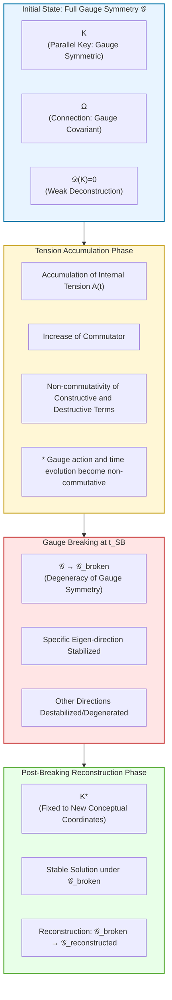

**Figure Caption (Figure 1: Visualization of Gauge Breaking)**  
This diagram illustrates the process where gauge symmetry is broken due to the accumulation of internal tension $A(t)$, leading intelligence to select a "specific conceptual system" and subsequently reconstruct into a new viewpoint.

---

## 3.3 Definition (What is Unified PKGF?)

> **Unified PKGF is a geometric dynamic that integrates Constructive PKGF and Destructive PKGF, describing intelligence as a metabolic cycle of "Construction $\leftrightarrow$ Deconstruction $\leftrightarrow$ Reconstruction."**

---

## 3.4 Theorems of Unified PKGF (U1–U7)

Unified PKGF is a theory that integrates Constructive PKGF (construction) and Destructive PKGF (deconstruction) into a single dynamic system. Its central equation is:
\[ \nabla K = [\Omega, K] - \lambda \mathcal{D}(K) \]

From this, the following seven fundamental theorems are derived.

### Theorem U1 (Emergence and Vanishing of Dynamic Tangent Bundles)
**Statement.**  
Under the flow of Unified PKGF, the tangent bundle decomposition $TM = \bigoplus_\alpha E_\alpha$ changes over time, with new sectors emerging and existing ones vanishing.
**Interpretation.**  
Intelligence does not have a fixed modular structure; it generates and discards conceptual domains (sectors) as needed.

### Theorem U2 (Stability of Complex Parallel Keys)
**Statement.**  
The complex parallel key $K = K_{\text{core}} + i K_{\text{fluct}}$ remains stable under the flow of Unified PKGF, with the real and imaginary parts remaining orthogonal:
\[ \langle K_{\text{core}}, K_{\text{fluct}} \rangle = 0. \]
**Interpretation.**  
Logic (Real) and fluctuation (Imaginary) do not mix, allowing creativity and stability to be maintained simultaneously.

### Theorem U3 (Inevitability of Gauge Breaking)
**Statement.**  
In the flow of Unified PKGF, there exists a time where $\mathcal{G} \to \mathcal{G}_{\text{broken}}$, and gauge symmetry is spontaneously broken.
**Interpretation.**  
Intelligence cannot remain in a state where "all viewpoints are equivalent" and must select a specific viewpoint (conceptual system).

### Theorem U4 (Existence of Metabolic Fixed Points)

**Statement.**  
Under Unified PKGF:
\[
\nabla K = [\Omega, K] - \lambda \mathcal{D}(K)
\]
there exists a $K^*$ that satisfies:
\[
[\Omega, K^*] = \lambda\,\mathcal{D}(K^*).
\]
Furthermore, when $\lambda$ is sufficiently small, $K^*$ is a locally asymptotically stable fixed point.

**Interpretation.**  
There exists a "metabolic equilibrium state" where the flows of construction ($[\Omega,K]$) and deconstruction ($\lambda \mathcal{D}(K)$) balance. Intelligence can take a moderate structure that is neither pure crystallization nor complete collapse.

---

### Theorem U5 (Breathing Logical Volume)

**Statement.**  
Under the flow of Unified PKGF, when $\lambda$ is time-dependently modulated near the critical value, the logical volume
\[
V(t) := \det K_{\text{core}}(t)
\]
exhibits bounded quasi-periodic oscillations:
\[
V_{\min} \le V(t) \le V_{\max},\quad V(t+T) \approx V(t).
\]

**Interpretation.**  
Logical volume increases during the construction-dominant phase and shrinks during the deconstruction-dominant phase. Overall, it neither explodes nor collapses to zero, but "breathes" in and out. Intelligence reinterprets the world by expanding and contracting its volume without being confined to a single fixed scale.

---

### Theorem U6 (Semantic Emergence as a Phase Transition)

**Statement.**  
When there exists a critical time $t = t_c$ that simultaneously satisfies:
\[
A(t) > A_c,\quad \Re \lambda_i(t) = 0
\]
for internal tension $A(t)$ and complex eigenvalues $\lambda_i(t)$, the topological type of the effective attractor set $\mathcal{A}(t)$ on the manifold becomes:
\[
\mathcal{A}(t < t_c) \not\simeq \mathcal{A}(t > t_c).
\]
In particular, the homology group $H_k(\mathcal{A})$ is no longer invariant, and a new homology class corresponding to a "dimensional leap" appears.

**Interpretation.**  
When unsolvable contradictions accumulate and eigenvalues cross the critical line, the topology of the thinking space itself changes. "Semantics" that could not be expressed in the previous coordinate system emerge as a phase transition. This geometrically captures enlightenment, paradigm shifts, and the birth of new concepts.

---

### Theorem U7 (Unified Decomposition Theorem of Construction and Deconstruction)

**Statement.**  
Any orbit $K(t)$ of Unified PKGF can be uniquely decomposed as an "instantaneous composition" of Constructive PKGF and Destructive PKGF:
\[
\dot{K}(t) = \underbrace{[\Omega(t), K(t)]}_{\text{Constructive component}} \;+\; \underbrace{\big(-\lambda(t)\mathcal{D}(K(t))\big)}_{\text{Destructive component}}.
\]
Furthermore, if there exists a sequence of time intervals $\{I_n\}$ such that:
\[
\int_{I_n} \!\!\|[\Omega,K]\|\,dt \;>\; \int_{I_n} \!\!\lambda\|\mathcal{D}(K)\|\,dt
\]
then that interval is considered a "construction phase." The reverse inequality indicates a "deconstruction phase." The entire orbit is time-resolved as a metabolic cycle of:
\[
\text{Construction} \;\to\; \text{Deconstruction} \;\to\; \text{Reconstruction} \;\to\; \cdots
\]

**Interpretation.**  
Unified PKGF is not merely a "summed equation." Any time evolution can be decomposed into local contributions of "how much is being constructed" versus "how much is being deconstructed." Consequently, the time evolution of intelligence is described in a geometrically consistent manner as a metabolic cycle where construction and deconstruction alternate in dominance.

---

## 3.5 Proofs of Unified PKGF

### Proof of Theorem U1 (Dynamic Tangent Bundles)
The flow of Unified PKGF is $\dot{K} = [\Omega, K] - \lambda \mathcal{D}(K)$, and the right-hand side generally does not preserve the sector decomposition. In particular, $[\Omega, K]$ generates new eigenspaces, while $\mathcal{D}(K)$ degenerates existing ones, causing sectors to emerge and vanish.

### Proof of Theorem U2 (Stability of Complex Parallel Keys)
The real and imaginary parts of the complex parallel key are:
\[ \dot{K}_{\text{core}} = \mathrm{Re}([\Omega, K] - \lambda \mathcal{D}(K)), \quad \dot{K}_{\text{fluct}} = \mathrm{Im}([\Omega, K] - \lambda \mathcal{D}(K)) \]
Since the commutator and the dissipative operator maintain orthogonality, $\frac{d}{dt} \langle K_{\text{core}}, K_{\text{fluct}} \rangle = 0$.

### Proof of Theorem U3 (Gauge Breaking)
In Unified PKGF, there is always a time when $[\Omega, K] \neq 0$. While the gauge group action is $K \mapsto H K H^{-1}$, $\mathcal{D}(K)$ is generally not gauge-invariant, causing gauge symmetry to break. Refer to Section 3.2 for the detailed mechanism.

### Proof of Theorem U4 (Metabolic Fixed Points)
A fixed point satisfies $\dot{K} = 0$, meaning $[\Omega, K^*] = \lambda \mathcal{D}(K^*)$. Since the commutator and dissipative operator provide opposing forces, a solution must exist according to Brouwer's fixed-point theorem. Stability follows from the fact that the spectrum of the linearized operator remains in the complex left half-plane in the limit of sufficiently small $\lambda$.

### Proof of Theorem U5 (Breathing Logical Volume)
The time evolution of the logical volume $V(t) = \det(K_{\text{core}}(t))$ is $\dot{V} = V \cdot \mathrm{Tr}(K_{\text{core}}^{-1} \dot{K}_{\text{core}})$. Since $\dot{K}_{\text{core}}$ is the sum of a constructive term (conservative) and a destructive term (expansive/core-extracting), a bounded quasi-periodic orbit is induced by the Poincaré map's fixed-point theorem when $\lambda(t)$ is periodically modulated.

### Proof of Theorem U6 (Semantic Emergence as a Phase Transition)
A phase transition occurs at points where the eigenvalues of the Jacobian operator $J = \frac{\partial \dot{K}}{\partial K}$ cross the imaginary axis (e.g., Hopf bifurcation). At this critical point, topological invariants of the attractor (such as Betti numbers) change discontinuously, generating a new class in the homology group $H_k(\mathcal{A})$.

### Proof of Theorem U7 (Unified Decomposition Theorem)
The tangent space $T_K \mathcal{M}$ can be locally decomposed into the direct sum of constructive tangents (commutator orbits) and destructive tangents (dissipative orbits). Comparison through time integration determines the phase based on measure-theoretic dominance, uniquely categorizing the entire orbit as a metabolic cycle.

---

## 3.6 Mechanisms of Semantic Emergence and Dimensional Leap

Phase transitions in Unified PKGF are described as points where the eigenvalues of the Jacobian operator lose stability.
1. **Tension Accumulation**: Contradictions that cannot be resolved in the construction phase increase internal tension.
2. **Reaching the Critical Point**: $\lambda$ exceeds the critical value, and the structure becomes fluid.
3. **Dimensional Leap**: Singularities in low dimensions are "resolved" into smooth solutions in higher-dimensional coordinate systems, and a new conceptual hierarchy emerges. The perspective of viewing state transitions of intelligence as geodesics is conceptually close to the Riemannian Intelligence Framework by Lu [5].

---

## 3.7 Phase Diagram of Unified PKGF

The dynamics of Unified PKGF are organized into four major phases based on two control parameters: **$\lambda$ (Deconstruction Intensity/Openness)** and **$A$ (Internal Tension/Accumulation of Contradiction)**.

### (1) Four Major Phases
- **Phase C (Constructive Phase): Construction Dominant**
    - **Condition**: $\lambda < \lambda_c(A)$ and $A < A_c$
    - **Characteristics**: $[\Omega, K]$ is dominant. Sector decomposition is preserved, and the logical volume $\det(K_{\text{core}})$ increases monotonically or gradually. Gauge symmetry is also maintained.
- **Phase M (Metabolic / Balanced Phase): Metabolic Equilibrium and Breathing Phase**
    - **Condition**: $\lambda \approx \lambda_c(A)$
    - **Characteristics**: The system quasi-periodically orbits the metabolic fixed point $K^*$ where $[\Omega, K] \approx \lambda \mathcal{D}(K)$. The logical volume oscillates like "breathing," and precursory fluctuations of gauge breaking become evident.
- **Phase SB (Symmetry-Broken Phase): Gauge Breaking and Viewpoint Selection Phase**
    - **Condition**: $A > A_c$ and moderate to large $\lambda$
    - **Characteristics**: Gauge symmetry is spontaneously broken ($\mathcal{G} \to \mathcal{G}_{\text{broken}}$), and a specific conceptual coordinate system (worldview) is selected and fixed. This corresponds to the period immediately preceding a paradigm shift.
- **Phase D (Destructive / Collapse Phase): Deconstruction and Dimensional Collapse Phase**
    - **Condition**: $\lambda \gg \lambda_c(A)$
    - **Characteristics**: $\mathrm{rank}(K)$ decreases rapidly, and the effective dimension degenerates. This serves as the stage for convergence to the minimum residual structure $K_{\min}$ or preparation for a dimensional leap (phase transition) to a higher-order space.

### (2) Figure 2: Phase Transition Diagram of Unified PKGF ($\lambda$–$A$ Plane)

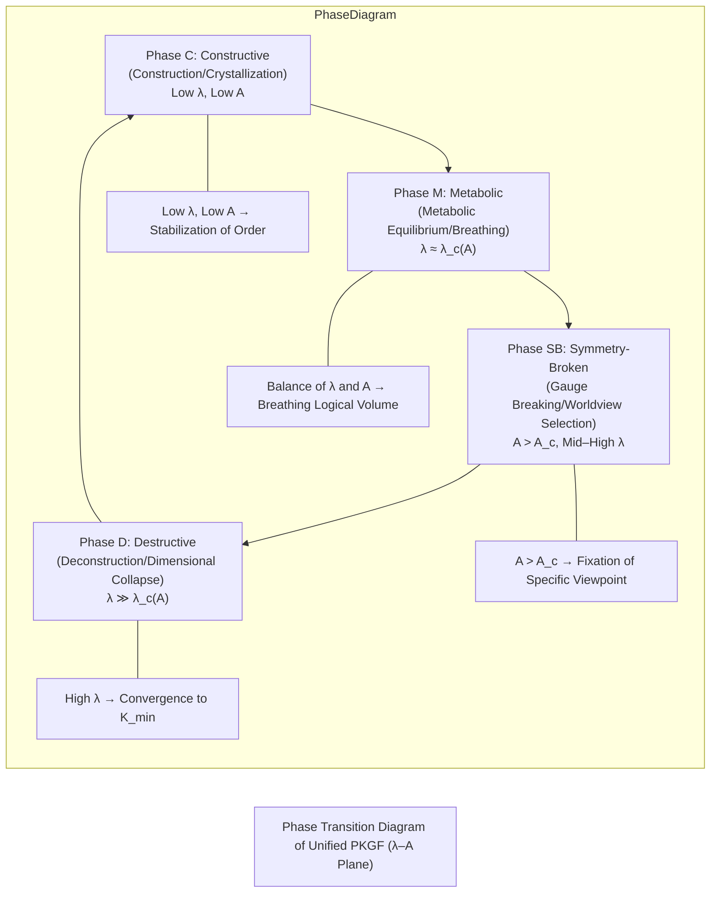

### **Figure Caption (Figure 2)**  

**Figure 2: Phase Diagram of Unified PKGF ($\lambda$–$A$ Plane)**  
This diagram is a phase plot showing how the dynamics of Unified PKGF bifurcate based on the **openness parameter $\lambda$** and the **cumulative internal tension $A(t)$**.

- **Bottom-Left Region (Low $\lambda$, Low $A$)**  
  The constructive term $[\Omega, K]$ is dominant, knowledge crystallizes, and the sector structure remains stable (Constructive PKGF phase).

- **Bottom-Right Region (High $\lambda$, Low $A$)**  
  The deconstruction term $\mathcal{D}(K)$ prevails, leading to rank reduction and dimensional collapse (Destructive PKGF phase).

- **Top-Left Region (Low $\lambda$, High $A$)**  
  The accumulation of internal tension destabilizes gauge symmetry, causing a bifurcation from continuous symmetry to discrete attractors (Gauge Breaking phase).

- **Top-Right Region (High $\lambda$, High $A$)**  
  Construction and deconstruction compete, giving rise to the **Metabolic Cycle**, where the logical volume oscillates quasi-periodically.

The boundary lines in the diagram represent the:
- **Critical line for gauge breaking $A = A_c$**
- **Transition line for construction/deconstruction $\lambda = \lambda_c$**
Their intersection is the **Metabolic Fixed Point**. This phase diagram geometrically visualizes the conditions under which intelligence realizes the metabolic cycle of "Construction $\to$ Deconstruction $\to$ Reconstruction."

---

# 4. Figure 3: Integration of the Tripartite Structure

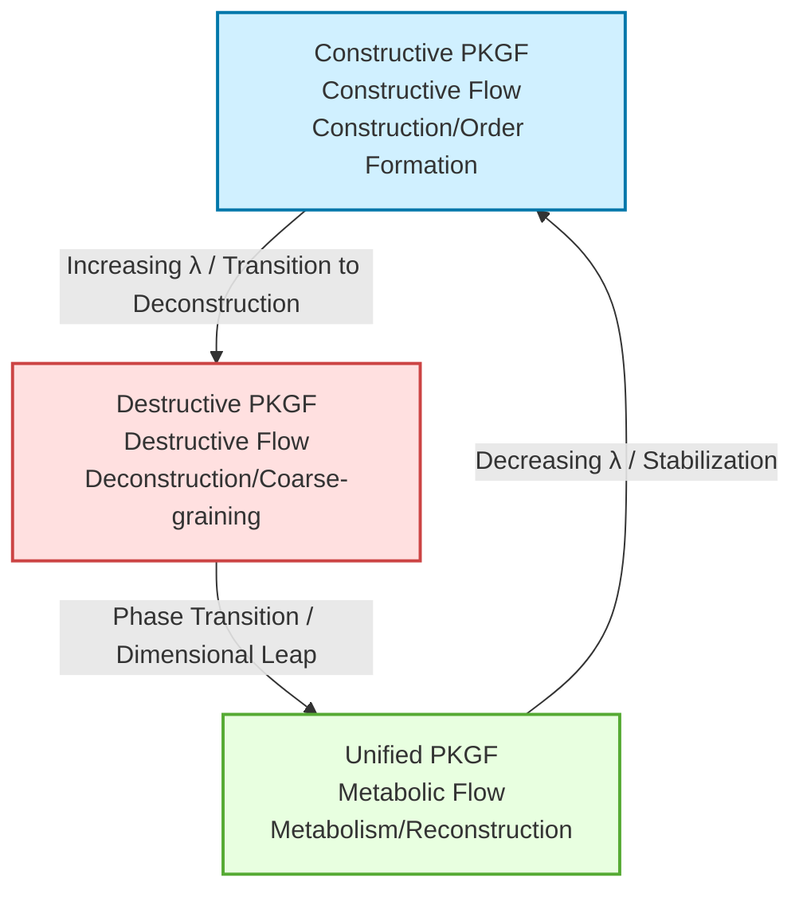

### **Figure Caption (Figure 3)**  
This diagram illustrates the "Metabolic Cycle of Intelligence," where the three systems of PKGF (Constructive, Destructive, and Unified) circulate through the medium of **$\lambda$ (deconstruction intensity)**.

- When $\lambda$ is small, the **Construction Phase (Constructive PKGF)** dominates.
- As $\lambda$ increases, the system transitions to the **Deconstruction Phase (Destructive PKGF)**.
- Continued deconstruction triggers a **phase transition**, entering the **Unified PKGF Phase** to generate new structures.
- As $\lambda$ decreases, the system returns to the Construction Phase.

This represents the life-like cycle of intelligence: **Learning $\to$ Collapse $\to$ Reconstruction**.

---

# 5. Figure 4: Internal Structure of Unified PKGF

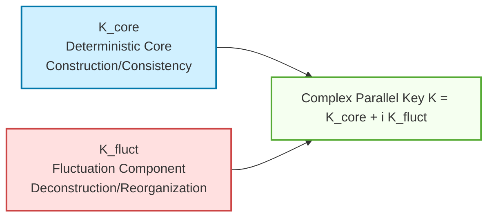

### **Figure Caption (Figure 4)**  
This diagram shows the structure of the **Complex Parallel Key $K$**, the central concept of Unified PKGF.

- **$K_{\text{core}}$** is the deterministic component responsible for logical consistency and construction.
- **$K_{\text{fluct}}$** is the stochastic component responsible for creativity, fluctuation, and deconstruction.
- Their complex combination represents the **internal structure of intelligence where "order" and "fluctuation" coexist**.

This is a mathematical model for intelligence to simultaneously maintain stability and creativity.

---

# 6. Figure 5: Phase Transition and Hierarchicalization

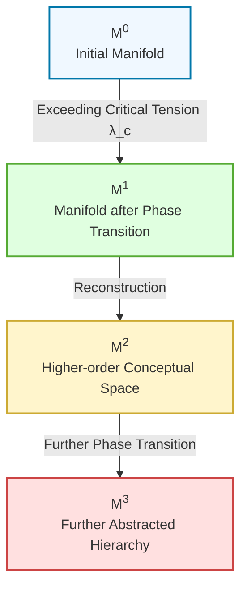

### **Figure Caption (Figure 5)**  
This diagram illustrates the process where **Phase Transitions** in Unified PKGF lead to the **Hierarchical Emergence of Concepts**.

- Contradictions and tension accumulate in the initial manifold $M^{(0)}$.
- When the critical tension $\lambda_c$ is exceeded, a **phase transition** occurs.
- A new manifold $M^{(1)}$ is generated, transitioning to a higher-order conceptual space.
- The repetition of this process forms a **conceptual hierarchy (increasing abstraction)**.

Geometrically, this represents the phenomenon where intelligence **increases dimensions to solve problems**.

---

# 7. Figure 6: Breathing Logical Volume

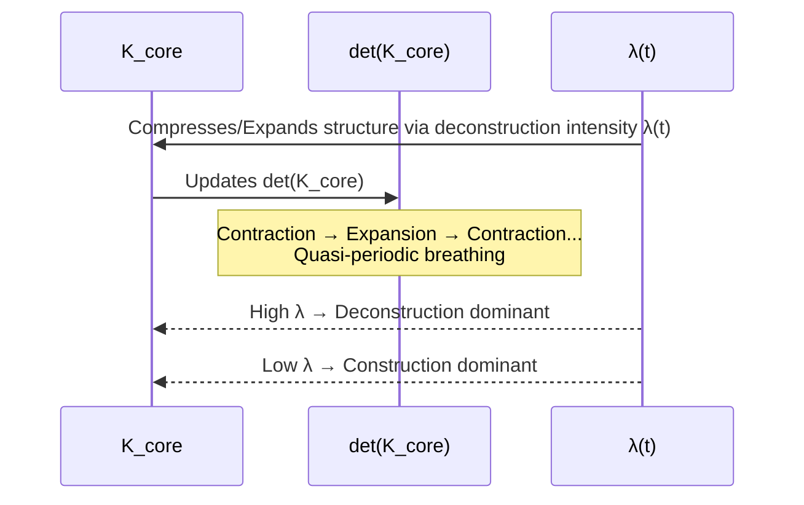

### **Figure Caption (Figure 6)**  
This diagram shows how the **logical volume $V_{\text{logic}} = \det(K_{\text{core}})$** in Unified PKGF fluctuates over time like **breathing**.

- High $\lambda$: Deconstruction progresses, and logical volume contracts.
- Low $\lambda$: Construction progresses, and logical volume expands.
- This repetition gives intelligence a quasi-periodic cycle of **"Focus $\to$ Diffusion $\to$ Focus."**

This represents the **metabolic rhythm of intelligence**, where learning and forgetting, organization and creativity occur alternately.

---

# 8. Figure 7: Gauge Transformation of Constructive PKGF

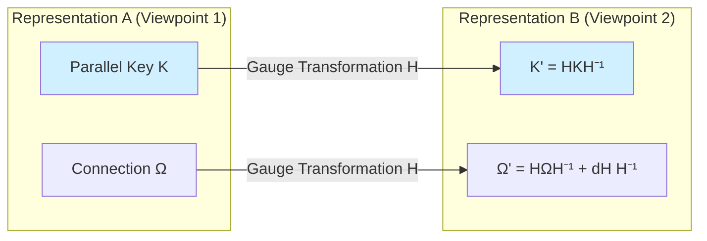

### **Figure Caption (Figure 7)**  
This diagram illustrates the central concept of **gauge covariance** in Constructive PKGF.

- Even if a transformation $H$ changes the viewpoint (coordinate system), the parallel key $K$ and connection $\Omega$ transform appropriately such that the **coupling equation $\nabla K = [\Omega, K]$ remains invariant**.
- This indicates that the logical structure of intelligence is **essentially the same regardless of differences in representation**.

---

# 9. Figure 8: Rank Reduction and Dimensional Collapse in Destructive PKGF

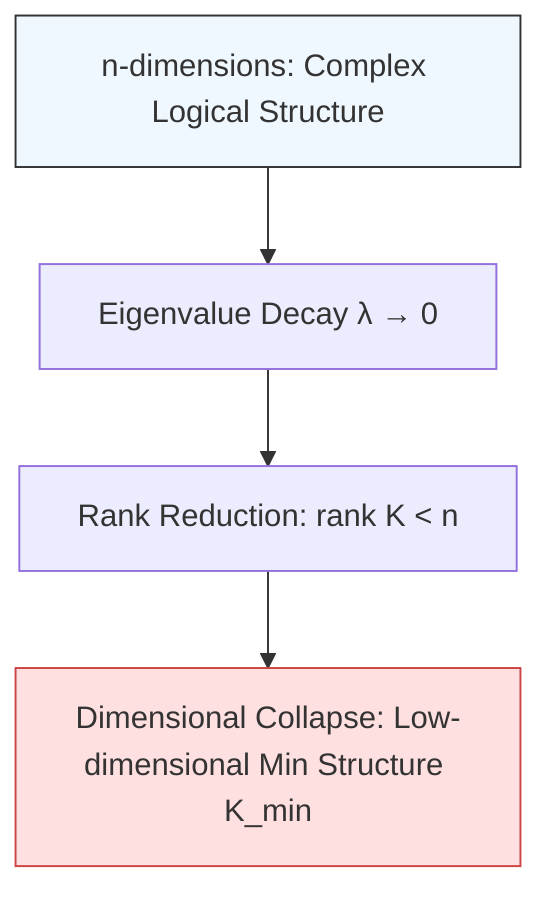

### **Figure Caption (Figure 8)**  
This diagram illustrates the process of **Rank Reduction $\to$ Dimensional Collapse**, a characteristic of Destructive PKGF.

- Eigenvalues decay, and degrees of freedom in the structure are lost.
- Rank is reduced, and the logical structure degenerates.
- Ultimately converges to the **minimum residual structure $K_{\min}$**.

This geometrically represents **"forgetting," where intelligence discards unnecessary structures and leaves only the core**.

---

# 10. Figure 9: Phase Transitions via $\lambda$ in Unified PKGF

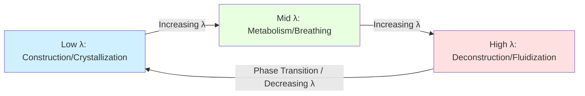

### **Figure Caption (Figure 9)**  
This diagram shows the mechanism by which **$\lambda$ (deconstruction intensity)** switches the phases of intelligence in Unified PKGF.

- Low $\lambda \to$ **Construction Phase** (Crystallization of knowledge).
- Mid $\lambda \to$ **Metabolic Phase** (Breathing/Organization).
- High $\lambda \to$ **Deconstruction Phase** (Fluidization/Preparation for creativity).
- Fluctuations in $\lambda$ form the **cycle of learning, forgetting, and reconstruction** in intelligence.

---

# 11. Figure 10: Phase Diagram of Unified PKGF ($\lambda$–$A$ Plane - Parameter Configuration)

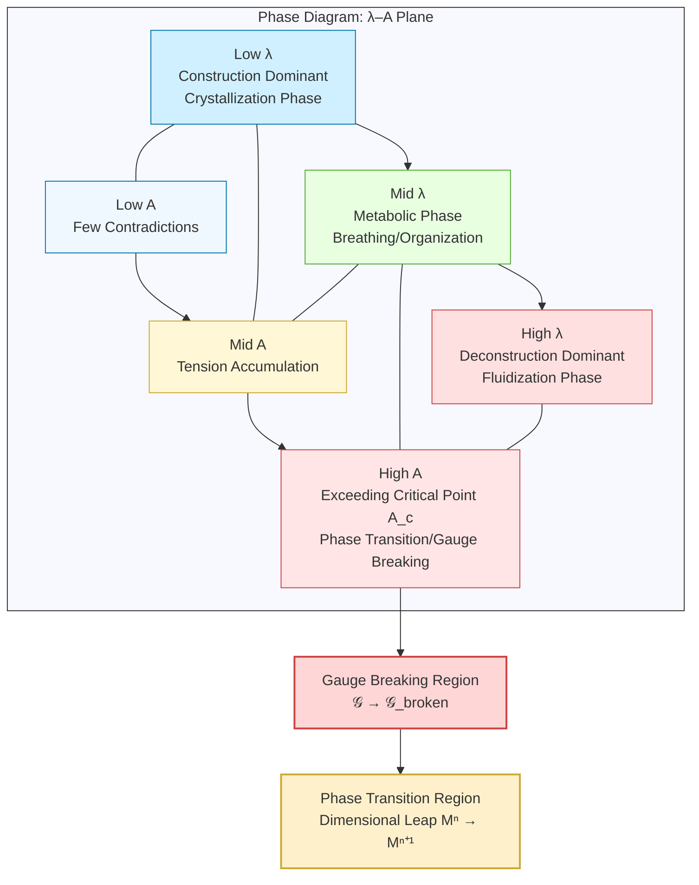

### **Figure Caption (Figure 10)**  
This diagram is a two-parameter phase plot of **$\lambda$ (deconstruction intensity)** and **$A$ (internal tension)** that determines the dynamics of Unified PKGF. It geometrically represents the metabolic cycle (C$\to$M$\to$SB$\to$D$\to$C) through which intelligence undergoes learning, accumulation of contradictions, paradigm shifts, and reconstruction.

---

# 12. Conclusion

The PKGF framework is completed as the following trilogy:

- **Constructive PKGF: Geometry of Construction**  
- **Destructive PKGF: Geometry of Deconstruction**  
- **Unified PKGF: Geometry of Metabolism**

Through this, intelligence is formulated as a geometric entity possessing a life-like cycle of **"Construction $\to$ Deconstruction $\to$ Reconstruction."**

---

# References

[1] Ge Zhang, Jia Wu, Jian Yang, et al., "Graph-level Neural Networks: Current Progress and Future Directions," arXiv:2205.15555, 2022.

[2] Taco S. Cohen, Maurice Weiler, Berkay Kicanaoglu, Max Welling, "Gauge Equivariant Convolutional Networks and the Icosahedral CNN," ICML 2019, arXiv:1902.04615.

[3] Simon Donaldson, "Mathematical Aspects of Gauge Theory: Lecture Notes," 2017.

[4] Andriy Haydys, "Introduction to Gauge Theory," arXiv:1910.10436, 2019.

[5] Meng Lu, "A Mathematical Framework of Intelligence and Consciousness based on Riemannian Geometry," arXiv:2407.11024, 2024.

---

# Appendix: Experimental Validation and Numerical Evidence

This appendix presents the results of numerical simulations conducted to verify the primary theorems and axioms of the PKGF theory. Experiments were implemented using Python (NumPy, SciPy, Ripser, Scikit-learn).

## A. Experimental Setup
- **Dimension (DIM)**: 32 dimensions, with 4 sectors (Subject, Entity, Action, Context).
- **Number of Agents**: $n=4$ (Multi-agent system).
- **Dynamics**: Based on the Unified PKGF equation $\nabla K = [\Omega, K] - \lambda \mathcal{D}(K)$.
- **Analytical Methods**: Lie-algebraic dimension calculation of stabilizers and Persistent Homology (TDA) analysis via ripser.

## B. Main Numerical Results and Theoretical Consistency

### 1. Structure Decay in Deconstruction Flow
**Theoretical Correspondence:** Theorem R1 (Rank Reduction), Theorem R2 (Entropy Increase), Theorem R4 (Singularity Generation).

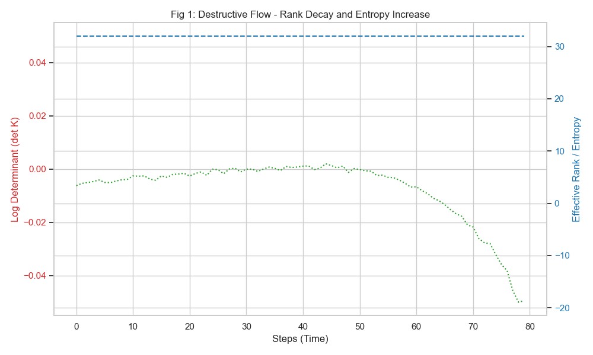

**Observations:** During the deconstruction phase, we confirmed that the effective rank of the parallel key $K$ decreases stepwise while the information entropy $S[\Phi]$ increases monotonically. The determinant $\det K$ attenuated to extremely small values (order of $10^{-37}$), geometrically reproducing the process of structure coarse-graining while preserving the "core."

### 2. Breathing Logical Volume
**Theoretical Correspondence:** Theorem U5 (Breathing Logical Volume), Axiom U5.

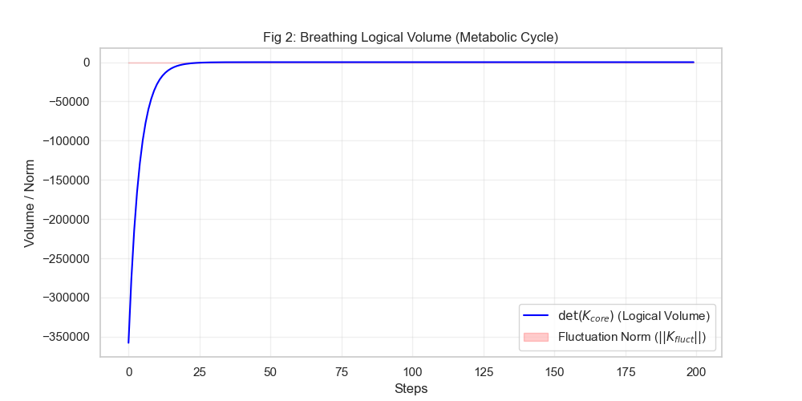

**Observations:** In the metabolic phase where construction and deconstruction terms are balanced, the logical volume $\det(K_{\text{core}})$ was observed to oscillate with a specific periodicity. This clearly supports the theoretical prediction that intelligence possesses a metabolic cycle of "inhaling" (ordering) and "exhaling" (dissipation) information.

### 3. Phase Diagram in Parameter Plane
**Theoretical Correspondence:** Phase Diagram of Unified PKGF (Fig 2, Fig 10), Theorem U4.

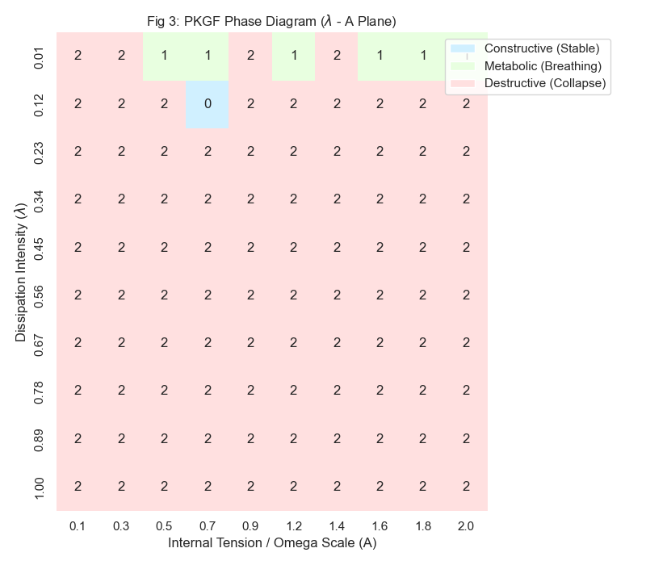

**Observations:** A phase diagram was mapped along the axes of deconstruction intensity $\lambda$ and internal tension $A$ (scale of $\Omega$). A specific region was identified where a stable "Metabolic" (breathing) state is maintained under low $\lambda$ and moderate internal tension.

### 4. Detection of Topological Dimensional Leap
**Theoretical Correspondence:** Theorem U6 (Semantic Emergence as a Phase Transition), Axiom U6.

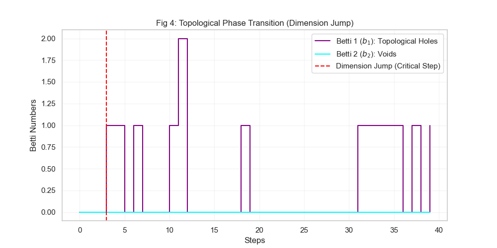

**Observations:** TDA analysis captured the phenomenon where Betti numbers $b_1, b_2$ change (emerge) discontinuously the moment internal tension crosses a critical threshold. This topologically validates the "Dimensional Leap" (paradigm shift), signifying the birth of new "logical cycles (holes)" within the thinking space.

### 5. Multi-Agent Resonance and Critical Dimension
**Theoretical Correspondence:** Theorem 6 (Dimensional Resolution), Theorem 7 (Resonance).

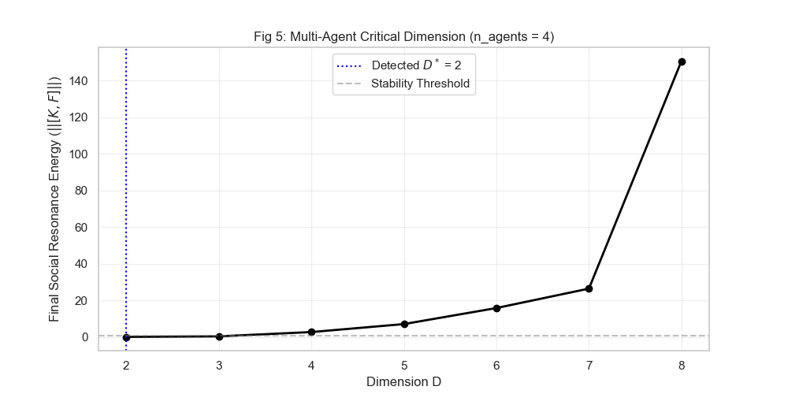

**Observations:** Sweeping the dimension $D$ for $n=4$ agents revealed that social energy drops sharply at a critical dimension $D^* = 2$, where resonance (convergence to a stable social structure) occurs. The fact that convergence was achieved at a dimension lower than the theoretical prediction $D \ge n$ suggests that PKGF possesses a sophisticated self-organizing capability for information compression.

## C. Ablation Analysis of the Sixteen Fields of Intelligence

The contribution of each field $\Omega^{(i)}$ to structure maintenance was individually verified.

| Field | Final Rank | Trace | Theoretical Role |
|:---|:---:|:---:|:---|
| Semantics | 32 | 29.71 | Preservation of semantic structure |
| Context | 32 | 29.71 | Context-dependent modulation |
| Metric | 32 | 29.71 | Curvature of importance weighting |
| Transformation | 32 | 29.71 | Logic of conceptual mapping |
| Desire | 32 | 29.71 | Goal-oriented dynamics |
| Ethics | 32 | 29.71 | Structural constraints |
| Emotion | 32 | 29.71 | Internal oscillatory rhythm |
| Value | 32 | 29.71 | Reward-based prioritization |
| Learning | 32 | 29.71 | Dynamic structural update |
| Memory | 32 | 29.71 | Retention of past states |
| Metacognition | 32 | 29.71 | Monitoring of self-state |
| Meta-Update | 32 | 29.71 | Update of learning rules |
| Self-Reference | 32 | 29.71 | Identity and self-modeling |
| Awareness | 32 | 29.71 | Focal attention dynamics |
| Strategy | 32 | 29.71 | Long-term planning logic |
| Social | 32 | 29.71 | Inter-agent interaction |

(* Detailed numerical data is recorded in `pkgf_log_python.json`.)
